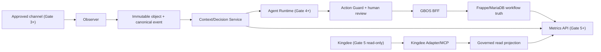

# Gate 2 数据流、服务边界与容量假设

状态：Gate 2 设计冻结候选。本文只描述 schema、synthetic fixture、mock 和
失败边界，不代表任何服务、连接器、模型、渠道、金蝶帐套、云环境或生产环境
已经运行。

## 四个真相层

| 真相层 | 权威系统 | 允许写入 | 跨层副本的最低要求 |
|---|---|---|---|
| Transaction Truth | Kingdee ERP | Gate 5 起只允许金蝶自身业务流程写入；GBOS V1 永无 writer | `site_id`、稳定源 ID、源版本、取得时间、分类、Crosswalk、血缘与只读状态 |
| Workflow Truth | Frappe/MariaDB（Frappe CRM + `esan_gbos`） | 人工审核后的 GBOS 内部命令 | `site_id`、revision、review status、命令与审批引用 |
| Context Truth | Observer + Context/Decision Service | Gate 3/4 受治理的证据、事实版本、冲突、决策与 timeline | EvidenceRef、valid/recorded time、来源、置信度、审核状态 |
| Analytical Truth | Metrics API | Gate 5 受治理的定义与 read model | 定义版本、lineage、freshness、coverage、reconciliation |

跨层数据只作受治理投影，**不得反向覆盖**权威系统。模型生成内容只能成为
Fact Proposal、AI Draft 或 Review Case；不能直接成为 Verified Business
Fact、正式 KPI、正式交易或对外承诺。

## 设计数据流

Gate 2 上图中的运行节点均为设计目标。Gate 2 的可执行范围只有本地、合成、
确定性的 schema/example/mock 验证；所有外部箭头均关闭。

## 服务边界

| 服务 | 责任 | 明确禁止 |
|---|---|---|
| Frappe/MariaDB | CRM/GBOS workflow、权限、人工审核、ApprovedCommand 和 BFF | 不保存完整原始通信/向量/Agent 队列；不复制金蝶正式交易账 |
| Observer | 渠道标准化、幂等、重放、checkpoint、不可变对象和 EvidenceRef | 不确认业务事实；不执行正式命令 |
| Context/Decision Service | evidence、事实版本、冲突、双时间、关系 provenance、决策链 | 不保存正式财务指标；不让未审事实覆盖已审事实 |
| Agent Runtime | 持久任务、lease、budget、retry、dead-letter、timeline | **不直连业务数据库**；不扩大调用者的 site/role/purpose/tool scope |
| Metrics API | 只提供定义冻结且可对账的 KPI | **不暴露任意 SQL**；不让 LLM 即兴计算成为官方数字 |
| ESAN MCP Gateway | 每请求鉴权、白名单工具与参数、审计和出站策略 | 不提供任意 DocType/Form/SQL/database writer，不 passthrough token |
| Kingdee Adapter | Gate 2 mock；Gate 5 才可能提供字段和行数受限的只读投影 | 永无 create/update/save/submit/audit/unaudit/delete/payment |

每个跨边界信封必须包含 `site_id`、稳定对象/事件 ID、来源系统、schema
版本、recorded time、数据分类、purpose 和 evidence/lineage 状态。接收方
重新验证这些字段，不信任上游已经完成的权限判断。

## 容量假设

以下数字是用于设计测试预算的**假设而非实测**，不能作为容量、SLO、成本或
生产可用性证据。Gate 3–5 必须用获批环境重新测量并调整。

| 工作流 | 单 site 假设 | 设计预算 | 首次实测 Gate |
|---|---:|---:|---|
| Observer canonical events | 平均 20,000/日，峰值 10 events/s | 单事件 1 MiB；批次 100；队列达到 80% 开始 backpressure | Gate 3 |
| Evidence objects | 平均 2,000/日，单对象 25 MiB，上传前隔离 | 对象 metadata p95 ≤ 500 ms；哈希/扫描异步且未完成不得发布 | Gate 3 |
| Context facts/relations | 2,000,000 active rows | 单跳查询 p95 ≤ 300 ms；受控两跳 p95 ≤ 800 ms | Gate 3/4 |
| Agent tasks | 10,000 active，峰值 20 claims/s | claim p95 ≤ 250 ms；lease 60 s；每任务 max attempts 5 | Gate 4 |
| Metrics queries | 峰值 10 requests/s | 缓存命中 p95 ≤ 500 ms，未命中 p95 ≤ 2 s | Gate 5 |
| Kingdee projection | 每对象每次最多 1,000 rows | 请求预算 30 s；分页、字段、过滤器均白名单 | Gate 5 |

容量测试按 `site_id` 隔离，不能用总吞吐掩盖单租户饥饿。队列、对象、日志、
上下文和 read model 各自设置配额；达到 rate limit 或容量上限时先降载或
拒绝，不自动扩大批量、权限、保留期或出站范围。

## 失败关闭规则

- schema、版本、`site_id`、purpose、授权、数据分类或 evidence/lineage
  缺失：`fail closed`，拒绝处理并生成脱敏审计。
- Observer 重放、乱序或供应商错误：保留 checkpoint，转隔离/dead-letter；
  不跳过缺口伪造连续性。
- Context 来源缺失、实体冲突或时间冲突：保持 proposal/open conflict，
  不确认事实，不静默合并。
- Agent 丢失 lease、超过 budget/rate limit/max attempts：停止执行，回收
  或进入 dead-letter；不增加权限或无限重试。
- Metrics freshness、coverage、lineage 或 reconciliation 任一失败：返回
  `unavailable`，不以旧值或模型估算替代正式 KPI。
- 外部副作用超时且结果未知：标记 `verification_required`，先查询/人工
  核验，禁止盲目重试。
- Kingdee metadata、会话、字段 Crosswalk 或只读查询失败：Gate 5
  `fail closed`；不回退到 mock 冒充真实结果。
- 达到 backpressure 阈值：拒绝新低优先级工作并告警；不得跨 site 借用
  未经批准的容量。

## Gate 2 能力状态

Gate 2 的真实 connector、model、channel、Kingdee、cloud、runtime 和
production 能力均为 `not_started` 或 `not_applicable`。网络调用、凭据
加载、真实业务查询、外部 writer 和部署的允许数量都是 0。Gate 2 设计
通过最多允许准备 Gate 3 implementation，不开启任何真实能力。
