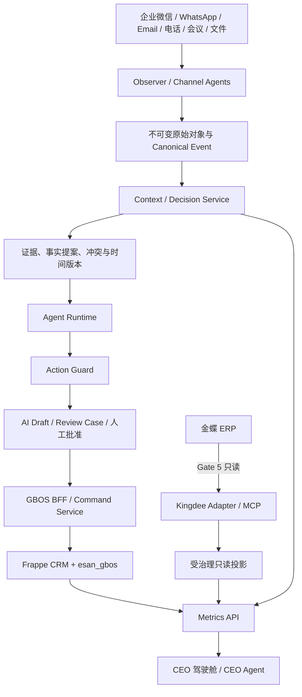

# ESAN GBOS v4 Agent、Context 与经营真相架构设计

- Status: Approved design
- Date: 2026-08-06
- Scope: Gate 2–6 roadmap; Gate 0/1 implementation and evidence remain unchanged
- Supersedes: v3 roadmap sequencing for Kingdee, Agent, context and metrics

## 1. 目标

ESAN GBOS 不是“在 ERPNext 中再做一套 CRM/ERP”，而是企业销售、产品、
采购协同、业务上下文和经营决策的 AI 原生操作前台。设计必须同时做到：

1. 不复制金蝶正式订单、库存和财务账。
2. 不让模型输出直接成为正式业务事实。
3. 每条重要事实、建议和决策都能追溯到证据。
4. Agent 是可恢复、可限额、可审核的持久任务，不是一次性聊天调用。
5. CEO 指标来自受治理的 Metrics API，不由大模型即时计算。
6. 金蝶真实连接延后到 Gate 5；Gate 2 只冻结设计、契约、mock 和安全边界。

## 2. 四个数据真相层

| 真相层 | 权威系统 | 负责内容 | 明确不负责 |
|---|---|---|---|
| Transaction Truth | 金蝶 ERP | 正式销售/采购订单、库存、应收应付、回款、成本、总账和财务结果 | CRM 跟进、沟通上下文、AI 建议 |
| Workflow Truth | Frappe CRM + `esan_gbos` | Lead、Organization、Contact、Deal、产品需求、样品、采购协同、工作项和人工审核 | 第二套订单、库存或财务账 |
| Context Truth | Observer + Context/Decision Service | 原始沟通引用、证据、实体解析、事实版本、冲突、时间变化、决策依据和 Agent 时间线 | 正式财务指标和未经审批的业务状态 |
| Analytical Truth | Metrics API | 已定义、可对账、带新鲜度/覆盖率/血缘的正式 KPI | 由 LLM 或临时图查询即兴生成的“官方数字” |

任何跨层副本都必须带 `site_id`、稳定源 ID、来源系统、取得时间、版本、
数据分类和证据/血缘状态。副本不得反向覆盖权威系统。

## 3. 目标架构



### 3.1 服务边界

- Frappe/MariaDB 继续保存业务工作流、权限、审核和 BFF 命令。
- Observer 负责渠道接入、标准化、重放、附件/录音入口和原始证据引用。
- Context/Decision Service 使用 PostgreSQL 保存证据、事实版本、冲突、
  图投影和决策链，向量检索采用 pgvector；对象存储保存原始文件。
- Agent Runtime 使用 Python/FastAPI、PostgreSQL 持久任务队列、Redis/Valkey
  和 Worker Pool。它通过契约访问其他服务，不直连业务数据库。
- Metrics API 是唯一正式 KPI 接口。它消费受治理投影，不暴露任意 SQL。
- ESAN MCP Gateway 只暴露白名单工具，不等同于任意数据库或 DocType 代理。

## 4. 证据、事实、决策和动作链

主链路固定为：

```text
Provider Payload
→ CanonicalObservationEvent
→ Communication Event
→ AI Observation
→ Evidence Record
→ Fact Proposal
→ Human/Rule Decision
→ Verified Business Fact
→ Decision Record
→ Action Proposal
→ Action Approval
→ ApprovedCommand
→ Action Execution
→ Verification
```

### 4.1 与现有 Gate 0 契约的关系

- `CanonicalObservationEvent` 继续作为跨渠道标准事件信封。
- `EvidenceRef` 继续作为不可变对象、消息偏移或录音时间段的稳定引用。
- `ExtractedFact` 作为 `Fact Proposal` 的基础契约，不另建语义重复的“AI事实”。
- `DraftMutation` 只表达对 `review_status = AI Draft` 内部记录的建议变更。
- `ApprovedCommand` 只在人工批准后执行 GBOS 内部正式命令；它不是金蝶 writer。
- `ConnectorCheckpoint` 继续负责 cursor、租约、重放窗口和错误状态。

Gate 2 必须先完成契约演进矩阵，说明新概念是复用、扩展还是新建，禁止同义
对象并存。

### 4.2 状态与时间

- Fact：`proposed → confirmed/rejected/superseded`。
- Conflict：`open → resolved/dismissed`，保留所有冲突版本，不做静默覆盖。
- Decision：记录输入事实版本、规则/模型版本、操作者、结论和生效时间。
- Action：`proposed → awaiting_approval → approved/rejected → executing →
  succeeded/failed → verified`。
- 重要事实使用双时间：`valid_time` 表示业务世界何时成立，
  `recorded_time` 表示系统何时得知。

来源与派生关系对齐 W3C
[PROV-O](https://www.w3.org/TR/prov-o/) 的 Entity、Activity、Agent 和
derivation 概念；只有当 PostgreSQL 图投影验证出明确价值后，才引入 RDF/
OWL 与 [SHACL](https://www.w3.org/TR/shacl/) 的正式运行时校验。

## 5. Context Graph

首版使用 PostgreSQL 中的规范化节点、关系、事实版本和 provenance 表构建
图投影，不在 Gate 2/3 引入 Neo4j、FalkorDB 或完整 Semantica 平台。

核心节点包括：

- Customer、Supplier、Contact、InternalUser
- CommunicationEvent、Requirement、Opportunity
- Product、ProductSpecification、SampleRequest
- Quotation、SalesOrder、PurchaseRequirement、SupplierQuotation、
  PurchaseOrder、Shipment、Receivable
- RiskSignal、Evidence、Decision、ActionProposal

核心关系包括：

- `WORKS_AT`、`COMMUNICATED_WITH`、`EXPRESSES_REQUIREMENT`
- `RELATES_TO`、`REQUESTED_SAMPLE`、`QUOTED_IN`、`CONVERTED_TO`
- `SUPPLIED_BY`、`DEPENDS_ON`、`IMPACTS`
- `SUPPORTED_BY`、`CONTRADICTS`、`SUPERSEDES`、`DERIVED_FROM`
- `CAUSED`、`INFLUENCED`、`APPROVED_BY`、`EXECUTED_AS`

关系必须有 `site_id`、valid/recorded time、来源、证据引用、置信度和状态。
仅向量相似不能自动建立正式关系；不确定实体合并必须进入 Review Case。

引入专用图数据库的门槛为：

1. PostgreSQL 图投影的真实查询无法满足已定义的 p95 或遍历需求。
2. 至少两个生产级用例证明专用图存储带来可测收益。
3. 双写、回放、备份、租户隔离和来源一致性方案通过 Gate 审查。

## 6. Agent Runtime 与 Action Guard

### 6.1 持久 Agent 任务

每个任务至少包含：

- `task_id`、`site_id`、agent type、subject/ref、status
- `due_at`、`recheck_at`、priority、token/cost/time budget
- `lease_owner`、`lease_expires_at`、attempt、max_attempts
- policy/model/prompt/tool versions
- input evidence、output artifact、failure classification
- parent/causation/correlation ID 和完整 timeline

Worker 使用 PostgreSQL 行锁领取任务；并发领取采用
`FOR UPDATE SKIP LOCKED`，同时保留 lease 过期回收、幂等和 dead-letter
处理。该并发模式须依据
[PostgreSQL 官方文档](https://www.postgresql.org/docs/17/sql-update.html)
实现并做竞争测试。

### 6.2 Agent 分工

- Gate 3：Channel Observer Agents 和实体解析提案。
- Gate 4：Sales、Purchase、Product/Sample Agents。
- Gate 5：基于 Metrics API、Exception Service、Context/Decision Service
  的 CEO Agent。

### 6.3 Action Guard

所有 Agent 共用一个策略执行点：

| 动作级别 | 自动化边界 |
|---|---|
| Read | 在 site、角色、用途、数据分类和字段白名单内自动 |
| Draft | 可自动创建内部 `AI Draft`、Fact Proposal、Work Item |
| Internal transition | 仅对策略明确允许且可逆的内部状态执行 |
| Fact confirmation | 必须有证据；低置信或冲突必须人工审核 |
| Commercial commitment | 报价、价格、折扣、付款条件、交期和供应商选择必须人工批准 |
| External side effect | 外发、正式文件、订单、支付等默认禁止或必须人工确认 |
| Kingdee mutation | V1 永久不存在；审核、反审核、删除、支付均不得自动执行 |

工具调用前和结果落库前各执行一次策略检查，防止模型通过返回内容绕过前置
校验。人工 override 必须记录原因、操作者、前后值和证据。

## 7. MCP 和工具边界

MCP 目标协议为 `2026-07-28`。该版本采用无状态、自包含请求及每请求能力
协商；正式实现前须再次核对
[官方规范](https://modelcontextprotocol.io/specification/2026-07-28)。
授权必须遵循明确用户控制、audience/resource 校验、禁止 token passthrough
和 SSRF 防护，参考
[官方安全实践](https://modelcontextprotocol.io/docs/2026-07-28/tutorials/security/security_best_practices)。

允许的工具族：

- `sales.customer.get`
- `sales.opportunity.search`
- `sales.follow_up.propose`
- `procurement.requirement.get`
- `procurement.supplier.compare`
- `procurement.risk.analyze`
- `context.entity.resolve`
- `context.evidence.get`
- `context.decision.trace`
- `metrics.kpi.get`
- Gate 5 才加入 `kingdee.sales_order.get`、`kingdee.inventory.get`、
  `kingdee.receivable.get` 等白名单只读工具

永不提供：

- `arbitrary_sql`
- `arbitrary_doctype`
- `arbitrary_form_id`
- `direct_database_write`
- `kingdee_write`、`kingdee_delete`、`kingdee_submit`、
  `kingdee_audit`、`kingdee_unaudit`

## 8. Gate 重新编排

### Gate 0：版本、架构和治理基线 — 已完成

保持已有冻结版本、共享契约、安全基线和证据，不回写历史结论。

### Gate 1：本地业务核心与 PWA — 已完成

保持现有 Frappe CRM/GBOS 工作流、BFF、权限、fixtures、PWA 和测试证据。

### Gate 2：Agent/Context/Metrics/Kingdee 设计与契约冻结

交付：

- 四个真相层、服务边界和数据流 ADR。
- 现有契约到证据—事实—决策—动作链的演进矩阵。
- Agent Task、Timeline、Fact/Conflict/Decision/Action、Metrics Response、
  Kingdee Read Projection 的 JSON Schema/OpenAPI 设计及合成样例。
- Context Graph ontology v0、关系约束、时间和 provenance 规则。
- Agent 状态机、lease/budget/retry/dead-letter 和 Action Guard policy。
- Metrics 目录、指标定义模板、血缘/新鲜度/覆盖率/对账契约。
- 金蝶字段字典、Crosswalk、查询 allow-list、Adapter/MCP 接口和 mock。
- 权限矩阵、数据分类、威胁模型、容量估算和 Gate 3–5 测试计划。

严格边界：零金蝶网络、零真实认证、零真实业务查询、零生产渠道、零真实
模型调用；不要求启动 Agent/Context/Metrics 生产服务。

退出条件：契约和样例通过自动验证；语义无重复；所有外部副作用默认关闭；
安全评审无未处理 Critical/High 设计缺陷；形成 Gate 3 可直接实施的任务包。

### Gate 3：观察与证据 MVP

交付：

- 选择一个正式 API 条件最成熟的渠道作为首个 connector。
- Provider payload → canonical event → communication event → evidence 的
  幂等、重放、断点续传和 dead-letter 闭环。
- 对象存储、hash、消息偏移/录音时间段、保留、删除和法律保全。
- 转写、语言识别、中文摘要和事实提案；默认不确认事实。
- Entity Resolution 提案、冲突检测和 Review Case。
- Context Service 的 PostgreSQL provenance/temporal 最小实现。

个人微信/工作手机在授权、平台规则、员工/联系人告知同意和稳定性未通过前
仅允许人工导入。

退出条件：fixture 与获批测试账号均可重放；重复事件不重复建档；证据定位
可复核；跨 site、撤回、删除、恶意文件和提示注入测试通过。

### Gate 4：持久 Agent Runtime、Context/Decision 与人工审核

交付：

- Durable Agent Task、lease、budget、priority、recheck、retry、
  dead-letter 和 timeline。
- Sales、Purchase、Product/Sample Agents。
- Fact Proposal → Conflict → Verified Fact → Decision Record。
- Action Proposal → Action Guard → Review Case → ApprovedCommand。
- 工具 sandbox、最小上下文、多模型网关、提示/模型/成本/质量版本记录。
- 基于合成数据的 CEO Agent 原型；不得称为正式经营指标。

严格边界：仍不连接真实金蝶；不自动外发、不自动报价、不改变 Won/Lost，
不执行正式订单或支付动作。

退出条件：并发领取不重复执行；崩溃后 lease 可恢复；预算和权限失败关闭；
事实可追溯；人工 override 完整；幻觉、越权、错误实体和提示注入评测通过。

### Gate 5：Analytical Truth、金蝶只读 MCP、CEO 驾驶舱与受控试点

交付：

- Metrics Registry、Metrics API、受治理 read model/warehouse。
- 指标定义、口径版本、数据血缘、新鲜度、覆盖率、对账和不可用原因。
- 独立 Kingdee Adapter/MCP 的启动、认证、metadata、业务查询四步验证。
- 受限 `AI_ReadOnly` 账号、每请求鉴权、出站 allow-list 和全量脱敏审计。
- 物料、客户、供应商、销售、采购、库存、应收等白名单只读投影。
- Crosswalk、增量 checkpoint、失败关闭、对账和源单 drill-through。
- CEO 驾驶舱、Exception Service 与正式 CEO Agent。
- 腾讯云新加坡预生产、小范围 UAT、回滚和故障演练。

退出条件：真实账号只读范围经过独立验证；工具发现中无任何写工具；任一
指标缺少口径、血缘、新鲜度、覆盖率或对账即显示不可用；预生产安全、隐私、
性能、恢复和 UAT 证据通过。

### Gate 6：V1 生产发布

交付：

- 安全评估、监控告警、审计、备份/PITR/灾难恢复。
- PIPL/跨境、隐私声明、渠道授权、DPA 和保留删除运行证明。
- 单租户生产 site 与未来 site-per-tenant 自动化模板。
- 容量、成本、SLO、值班、事件响应、回滚和 Go/No-Go 证据包。

V1 生产仍不提供金蝶写工具或模型直接业务 writer。

## 9. 失败处理

- 证据缺失、来源不明、实体冲突或时间冲突：不得确认事实。
- 鉴权、权限、scope、策略或版本不匹配：拒绝并记录脱敏审计。
- Metrics 数据过期、覆盖不足或对账失败：返回 `unavailable`，不显示旧值为正式指标。
- Agent 超预算、lease 丢失、重复或异常：停止、重试/回收或进入
  dead-letter，不扩大工具权限。
- Kingdee metadata、会话或业务查询失败：Gate 5 失败关闭，不回退到 mock
  冒充真实数据。
- 外部副作用结果未知：标记 `verification_required`，禁止盲目重试。

## 10. 关键验收

- 所有层级的列表和单记录权限一致，跨 site/跨团队访问失败关闭。
- 证据 hash、偏移/时间段和派生链可重放验证。
- 同一 Provider Event、Fact Proposal、Agent Task 和 Command 的幂等键有效。
- 冲突事实不能静默覆盖；正式事实只能由规则/人类批准产生。
- Agent 并发、lease 超时、崩溃恢复、预算和 dead-letter 有自动化测试。
- Action Guard 对允许/拒绝动作做正反向矩阵测试。
- CEO 正式指标全部来自 Metrics API；LLM 不执行 KPI 算术或任意查询。
- Gate 2–4 的金蝶网络调用和真实凭据数量均为 0。
- Gate 5 的金蝶写调用数量永久为 0。
- 每个 Gate 都提交版本、测试、权限、安全、浏览器、数据治理、限制和
  Go/No-Go 证据摘要。

## 11. 未采用方案

- **在 Frappe 中保存所有原文、向量和 Agent 任务：** 数据隔离、容量和
  异步恢复边界不清，拒绝。
- **Gate 2 即连接金蝶：** 会让集成先于语义、权限和指标治理，已明确延后到
  Gate 5。
- **从第一天部署专用图数据库/完整语义平台：** 运维和一致性成本高，先用
  PostgreSQL 验证需求。
- **让 CEO Agent 直接汇总数据库或图：** 口径不可治理，正式指标统一走
  Metrics API。
- **复制外部开源项目代码：** 只借鉴可验证的架构模式；任何未来代码引入
  必须单独完成许可证、SBOM、安全和适配审查。
