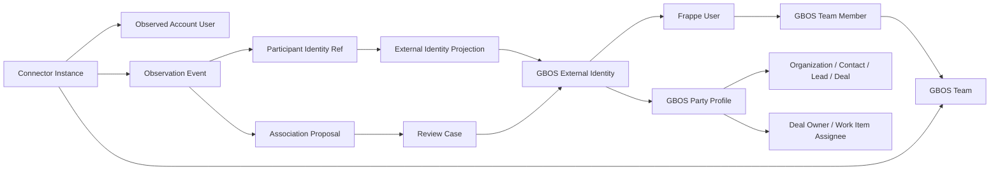

# ESAN GBOS 用户与观察身份解析设计

- Status: Approved design
- Date: 2026-08-09
- Scope: 本地真实渠道、AI 观察、用户/客户身份关联和人工审核
- Depends on: 当前 `main`、Frappe CRM/GBOS 团队权限、Observer 本地试点数据面

## 1. 目标

在真实 Email、WhatsApp、企业微信和录音数据进入 GBOS 前，建立可审计、
可撤回、跨消息稳定且不会被 AI 直接确认的身份关系。系统必须分开表达：

1. 哪个系统用户或团队拥有渠道账号。
2. 谁参与了某次沟通。
3. 外部参与者对应哪个客户、联系人或内部用户。
4. 谁负责后续 Deal、样品、询源或 Work Item。

身份解析不改变现有数据权威：Frappe `User`、CRM Contact/Organization 和
`GBOS Party Profile` 是业务身份权威；Observer 只保存来源身份、解析投影和
证据；AI 只生成关联建议。

## 2. 冻结关系模型



### 2.1 四种不同关系

| 关系 | 权威字段 | 用途 |
|---|---|---|
| 数据访问 | `Observation.team_ref` 与 `GBOS Team Member.user` | 决定谁能看观察投影 |
| 渠道账号归属 | `Connector Instance.account_user_ref`，可空 | 表示被采集的邮箱或工作账号属于谁 |
| 沟通参与者 | `Participant.identity_ref` | 表示消息中的内部、外部、系统或未知参与者 |
| 业务负责人 | Deal owner、`owner_user`、`assigned_to` | 表示谁负责后续业务动作 |

上述关系不得互相推断。例如邮箱账号属于销售 A，不代表每封邮件都是销售 A
发送；客户联系人参与沟通，也不代表该联系人是 Deal owner。

## 3. 稳定身份引用

### 3.1 Provider subject

Email 地址、WhatsApp `wa_id`、企业微信 `userid/external_userid` 等原始身份只在
本地受控解析边界中出现。进入 Observer 和 Frappe 映射前，将其转换为：

```text
extid:v1:<provider>:<site-purpose-scoped-hmac>
```

规则：

- HMAC 密钥来自 macOS Keychain 物化的 `0600` secret。
- 输入包含 `site_id`、processing purpose、provider 和规范化后的 subject。
- 同一 site/provider/subject 稳定；跨 site 或 purpose 不可关联。
- 数据库、日志、错误、审计和模型请求不保存原始邮箱、电话或账号。
- provider 未提供可用 subject 时，继续使用 delivery-scoped unresolved ref，
  不伪造跨消息稳定身份。

### 3.2 Frappe 权威映射

复用 `GBOS External Identity`：

- `identity_provider`：闭合 provider 值。
- `external_subject`：只允许上述 opaque token，不保存明文。
- `identity_type = User` 时必须且只能设置 `user`。
- `identity_type = Party` 时必须且只能设置 `party_profile`。
- `identity_type = Channel` 时表示渠道账号，不得冒充沟通参与者。
- User 必须属于同一团队；Party Profile 必须属于同一团队。
- `(identity_provider, external_subject)` 保持数据库唯一。
- `AI Draft/Pending` 不生效；只有 `Approved + Active` 映射可用于权限和展示。

## 4. 解析数据流

```text
Provider payload
→ 本地 subject 规范化与 HMAC token
→ Canonical Observation / Participant.identity_ref
→ 按可信 Connector routing 写入 team_ref
→ 查询已批准 External Identity
→ 命中一个：写入只读 resolution projection
→ 未命中：生成 Association Proposal
→ Review Case 固定证据、候选对象和 revision
→ 人工 Approved/Rejected
→ Approved External Identity
→ 后续事件复用；历史事件按映射 revision 可追溯
```

Observer 不直连 MariaDB。它通过独立、只读、每请求鉴权的 Frappe internal
identity endpoint 解析 approved mapping，并在 PostgreSQL 保存最小投影：

- `site_id`
- provider、opaque subject ref
- Frappe mapping ref 与 revision
- `team_ref`
- target type、target ref
- status、resolved_at

投影不复制姓名、邮箱、电话或客户原文。

## 5. 权限语义

- CEO、GBOS Admin：可读全部团队的业务投影，原始证据仍按独立 raw policy。
- 普通用户：可读自己所在团队的数据。
- “本人参与”访问仅在存在 `Approved + Active` 的 User 映射时成立。
- AI 建议、未审核映射、display name、向量相似或模型置信度都不得扩大权限。
- External Identity 只能由 Integration Admin/GBOS Admin 管理；Reviewer 只能
  处理分配的 Review Case，不能直接改映射或业务主体。
- 映射撤回或 Superseded 后立即停止用于新的 self-access；历史审核证据保留。

## 6. 用户界面

不增加一级菜单。身份解析嵌入：

- 沟通详情：显示“未解析 / 已建议 / 已确认 / 已撤回”。
- 关联建议：显示目标类型、目标对象、置信度和证据，不显示敏感原始 subject。
- Review Queue：增加 Identity Resolution 类型。
- External Identity 详情：仅 Integration Admin/GBOS Admin 可维护。
- 普通销售可建议正确客户/联系人，但不能确认合并。

## 7. 失败关闭

- 无 provider subject：保留 delivery-scoped unresolved，不跨消息合并。
- 多候选或团队不一致：进入 Review Case，不选最高分自动绑定。
- 同一 token 出现不同 approved target：冲突并暂停解析。
- Frappe identity endpoint 不可用：观察事件仍可入库，但保持 unresolved。
- 映射 revision 漂移：拒绝旧审核决定。
- Connector team 与映射 team 不一致：拒绝，不允许模型覆盖 Connector routing。
- Tokenization/HMAC 失败：隔离消息，不向 DeepSeek 发送原始身份。

## 8. 验收标准

- 同一 sender 的两条消息得到相同 opaque identity ref。
- 不同 site/purpose 的同一 sender 得到不同 ref。
- 仓库、日志、PostgreSQL 和模型请求中没有测试邮箱/电话哨兵。
- Approved User 映射后 self-access 生效；Pending/Rejected 映射不生效。
- Party 映射只影响客户关联展示，不授予该客户系统访问权限。
- AI 只能创建 proposal 和 Review Case，不能自动批准 External Identity。
- 重新处理、崩溃恢复和幂等重放不产生重复映射或 Review Case。
- 撤回映射后，新请求不再使用该映射，历史决策仍可审计。
